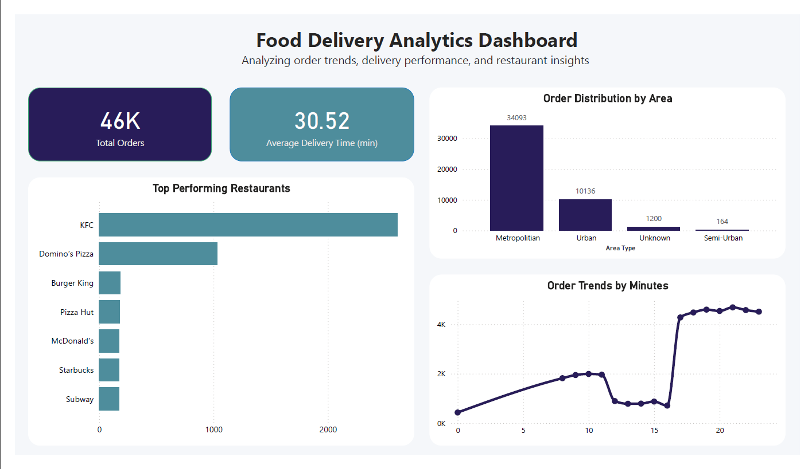

# Food Delivery Big Data Analytics 🚀

## 📌 Overview
This project analyzes a food delivery dataset using Big Data tools to generate meaningful business insights.

## 🛠 Tools Used
- Apache Spark (PySpark)
- Power BI

## 🔄 Data Pipeline
Raw Data → Spark Processing → Aggregated Data → Power BI Dashboard

## 📊 Key Insights
- Order distribution by area
- Top performing restaurants
- Peak order hours
- Average delivery time

## 📁 Project Structure
- data → raw dataset
- spark_jobs → PySpark scripts
- output → processed data
- dashboard → Power BI file

## 🚀 How to Run
1. Install PySpark
2. Run `analysis.py`
3. Open Power BI dashboard

## 📷 Dashboard Preview

